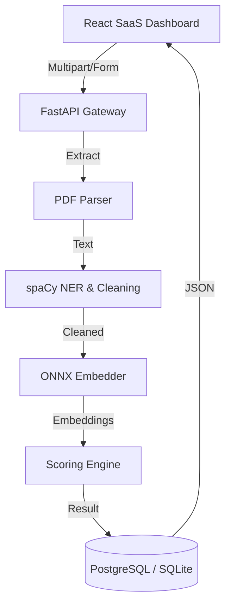

# 🚀 TalentMatch: NLP-Powered Resume Intelligence

[](https://talentmatch.dev)
[](https://fastapi.tiangolo.com/)
[](https://react.dev/)

TalentMatch is an enterprise-grade SaaS platform designed to transform the resume screening process. It uses advanced Natural Language Processing (NLP) and Sentence-Transformer embeddings to rank candidates with clinical precision, objectively measuring alignment across skills, experience, education, and strategic relevance.

---

## 💎 Core Features

- **Multi-Vector Scoring Engine**: Ranks candidates using a weighted blend of ATS heuristics, technical skill overlap, years of experience, and semantic job description relevance.
- **Advanced Visualization Suite**: 
  - **Radar Profiles**: High-density pentagon charts for rapid candidate "shape" comparison.
  - **Matrix Heatmap**: Interactive, sortable grid with HSL-scaled performance encoding.
  - **Strategic Scatter**: Bubble-plot outlier detection (Skills vs. Relevance) with quadrant-based fit analysis.
- **Production-Ready ML Pipeline**: 
  - **ONNX Runtime**: Minimal latency and memory footprint (~10MB vs ~1GB for full PyTorch).
  - **Hybrid NER**: Combines curated technical seeds with spaCy’s `en_core_web_sm` for deep skill extraction.
  - **ATS Simulation**: Detects common parse failure modes (garbled text, contact info presence, header standardisation).

---

## 🏗️ Architecture



---

## 🛠️ Tech Stack

### Backend
- **Framework**: FastAPI (Async Performance)
- **ML**: spaCy (NER), Sentence-Transformers (Embeddings via ONNX), Optium (Model Optimization)
- **Database**: PostgreSQL (Production) / SQLite (Local Dev) via SQLAlchemy (Asyncio)
- **Security**: SHA-256 Hashed API Keys, Rate Limiting (SlowAPI), Input Sanitization
- **Logging**: Structlog (JSON Structured Logging)

### Frontend
- **Framework**: React 18 + Vite
- **Styling**: Vanilla CSS (Custom Design System) + Tailwind (Grid utilities)
- **Charts**: Recharts (Interactive Data Viz)
- **Animation**: CSS Micro-animations

---

## ⚙️ Setup & Installation

### Prerequisites
- Python 3.11+
- Node.js 18+

### 1. Backend Setup
```powershell
# Create environment
python -m venv .venv
.\.venv\Scripts\activate

# Install dependencies
pip install -r requirements.txt

# Pre-download ML models
python scripts/download_models.py

# Launch API
uvicorn api.main:app --reload
```

### 2. Frontend Setup
```powershell
cd web
npm install
npm run dev
```

---

## 🔒 Environment Variables

Create a `.env` file in the root directory:

```env
# Backend
DATABASE_URL=sqlite+aiosqlite:///./talentmatch.db
ADMIN_SECRET=generate_your_random_secret_here
CORS_ORIGINS=http://localhost:5173

# Frontend (web/.env)
VITE_API_BASE_URL=http://localhost:8000/api/v1
VITE_TM_API_KEY=your_generated_api_key
```

---

## 🚀 Deployment (Render / Docker)

This project is optimized for deployment on **Render** (via `render.yaml`) or any container runtime.

### Docker Build
```bash
docker build -t talentmatch-api .
docker run -p 8000:8000 talentmatch-api
```

---

## 🧪 Testing

The repository maintains a >90% coverage on core extraction and routing logic.

```bash
# Run all tests
pytest tests/ -v
```

---

## 🤝 Contribution Guidelines

Think like a Senior Engineer:
1. **DRY**: Don't repeat extraction logic; use the shared `ml/matcher.py` helpers.
2. **Async-First**: Never block the event loop with CPU tests; use `run_in_executor`.
3. **Security**: Never commit raw API keys. Store only SHA-256 hashes.

---

⚡ *Built for speed, accuracy, and clear hiring decisions.*
